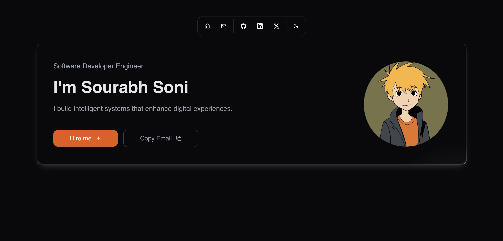

# Portfolio - Sourabh Soni

A modern, responsive portfolio website built with React, Vite, and TailwindCSS, featuring a sleek design with dark mode support and interactive UI elements.


[Live Demo](https://show.makethumb.com)

## 🚀 Features

- **Responsive Design**:

  - Mobile-first approach
  - Optimized for all screen sizes
  - Fluid typography and spacing
  - Adaptive layouts

- **Dark Mode**:

  - System preference detection
  - Smooth theme transitions
  - Persistent theme selection
  - Custom color schemes

## 🛠️ Tech Stack

### Frontend

- **React 18**: UI library
- **Vite**: Build tool
- **TailwindCSS**: Styling
- **Framer Motion**: Animations
- **Radix UI**: Accessible components
- **Lucide Icons**: Icon system

### UI Components

- Custom Magic UI components:
  - RetroGrid
  - BorderBeam
  - MagicCard
  - CoolMode
  - LineShadowText
  - Marquee
  - Dock

### State Management

- React Hooks
- Context API
- Local Storage

### Development Tools

- **ESLint**: Code linting
- **Prettier**: Code formatting
- **PostCSS**: CSS processing
- **TypeScript**: Type checking

## 🏃‍♂️ Running Locally

1. Clone the repository

   ```bash
   git clone https://github.com/yourusername/portfolio.git
   ```

2. Install dependencies

   ```bash
   cd portfolio
   npm install
   ```


4. Start the development server

   ```bash
   npm run dev
   ```

5. Build for production
   ```bash
   npm run build
   ```

## 📦 Project Structure

```
src/
├── components/         # React components
│   ├── ui/            # Reusable UI components
│   ├── magicui/       # Custom magic UI effects
│   ├── shared/        # Shared components
│   └── sections/      # Page sections
├── lib/               # Utility functions
├── data/             # Static data
├── styles/           # Global styles
├── hooks/            # Custom React hooks
└── context/          # React context providers
```

## 🎨 Features Showcase

### Hero Section

- Dynamic introduction
- Animated elements
- Call-to-action buttons
- Profile image with effects

### About Me

- Professional background
- Interactive cards
- Skill badges
- Location integration

### Projects

- Work showcase
- Project details
- Live demos
- GitHub links

### Skills

- Technical expertise
- Visual representations
- Progress indicators
- Category grouping

### Experience

- Professional timeline
- Company details
- Role descriptions
- Achievement highlights

### Contact

- Interactive form
- Email integration
- Social links
- Location map

## 🔧 Customization

1. **Theme Colors**:
   Edit `tailwind.config.js` to modify the color scheme

2. **Content**:
   Update data files in `src/data/` directory

3. **Styling**:
   Modify global styles in `src/styles/globals.css`

4. **Components**:
   Customize components in `src/components/`

## 📱 Mobile Support

- Responsive navigation
- Touch-friendly interactions
- Optimized images
- Adaptive layouts
- Mobile-first design

## 🚀 Deployment

1. Build the project

   ```bash
   npm run build
   ```

2. Deploy to your preferred platform:
   - Netlify
   - CloudFlare Workers

## 🤝 Contributing

1. Fork the repository
2. Create your feature branch
3. Commit your changes
4. Push to the branch
5. Open a pull request

## 📝 License

MIT License - see the [LICENSE](LICENSE) file for details

## 🔗 Links

- [Live Demo](https://show.makethumb.com)
- [GitHub Repository](https://github.com/sourabhs701/show)

## 👤 Contact

Sourabh Soni

- Email: [sourabhs701@gmail.com]

## 🙏 Acknowledgments

- [React Documentation](https://reactjs.org/)
- [Vite](https://vitejs.dev/)
- [TailwindCSS](https://tailwindcss.com/)
- [Framer Motion](https://www.framer.com/motion/)
